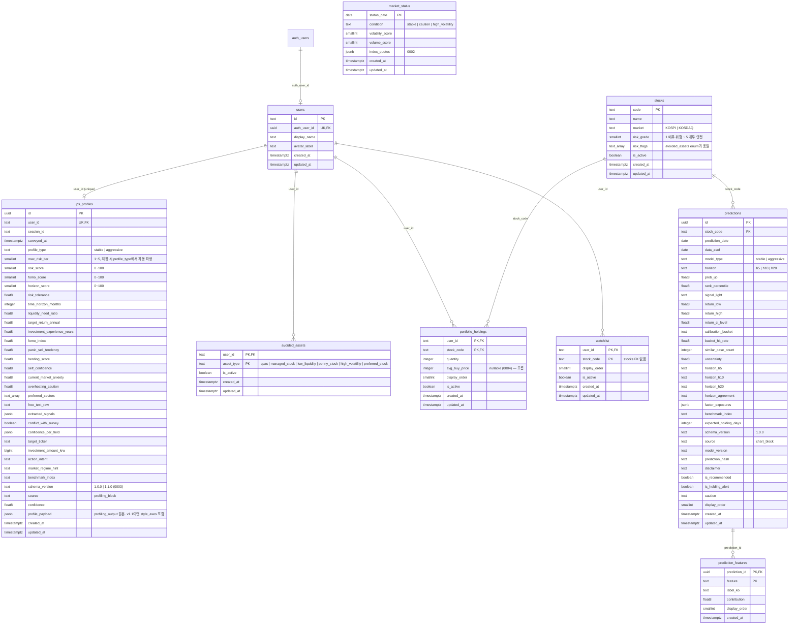

# Supabase ERD

`supabase/migrations/` 0001~0014 기준(모두 프로덕션 적용 완료, 2026-10-07 `migration list` 확인). 아래 그림은 사용자·예측 테이블(0001~0004), 0005 이후 테이블은 그림 다음 표에 있다. 스키마가 바뀌면 이 문서와 `frontend/lib/types.ts`를 함께 고친다.

> 0004(2026-09-22): `portfolio_holdings.avg_buy_price` nullable. 비어 있으면 화면은 기준일 종가 × 수량으로 비중을 세고 "현재가 기준"으로 표시한다. RLS 정책은 그대로(3개).
> 8축은 별도 컬럼 없이 `profile_payload.style_axes`에 저장하므로 0003 없이도 앱은 동작한다(8축만 null).



## 0005 이후 테이블 (2026-10-07)

| 마이그레이션 | 테이블·함수 | 주요 열 | 공개 읽기 | 보존 |
|---|---|---|---|---|
| 0005 | `news_sentiment_tracks`·`news_sentiment_daily`·`news_articles`, `financial_snapshots`·`financial_metrics` | 종목·트랙(historical/live)·일별 감성, 재무 6지표·근거 | ✅ | 뉴스 원문 90일(일별 집계는 유지) |
| 0006 | `stock_notes` | 사용자·종목·메모 | 본인만 | — |
| 0007 | `chart_releases`·`chart_batches`·`chart_signal_snapshots`·`chart_universe`·`chart_prices`·`chart_feature_snapshots`, 뷰 `latest_chart_signal_snapshots` | 게시 배치·H5/H20 payload·종목 목록·가격·입력 파일 경로 | 게시분만 | 게시 배치 최근 5개, 입력 파일 30일 |
| 0008 | 함수 `delete_my_account()` | — | 로그인 사용자 실행 | — |
| 0009 | `chart_prediction_log`, 함수 `log_chart_predictions()`·`prune_chart_batches(p_keep)` | 종목·as_of·기간·클래스 확률·신호·batch_id | 서비스 롤만 | **영구** |
| 0010 | 함수 `budget_usage()` | DB·Storage 크기, 마지막 게시 as_of | 서비스 롤만 | — |
| 0011 | `disclosures` | 접수번호·종목·제목·유형·공시일(원문 본문 없음) | ✅ | 90일 |
| 0012 | `financial_snapshots.report_code` | 정기보고서 종류(1분기·반기·3분기·사업) | ✅ | — |
| 0013 | `supply_demand` | 종목·거래일·개인·외국인(`foreign_investor`)·기관 순매수(주) | ✅ | 60영업일 |
| 0014 | `stocks.volatility_annual`·`volatility_percentile`·`risk_as_of` | 1년 변동성·코스피 내 백분위·기준일 | ✅ | — |

- `stocks`는 차트 서빙 universe(코스피 전 종목 + 에코프로비엠)로 매일 insert·update된다(`stock_master.py`, 삭제 없음). 위험 표시 규칙은 [stock-master-rules.md](stock-master-rules.md).
- 0007 스냅샷 가드 트리거는 staging 배치의 스냅샷만 지우게 한다. 보존 정리는 `prune_chart_batches`가 한 트랜잭션 안에서 staging으로 돌린 뒤 스냅샷 → 배치 순서로 지운다.

## `ips_profiles.profile_payload.style_axes` 형태

`schema/profiling_output.schema.json` v1.1 `style_axes` ↔ `frontend/lib/types.ts` `StyleAxes`.

```json
{
  "assessment_mode": "quick | detailed",
  "axes": [
    { "axis_id": "turnover", "ratio": -0.25, "confidence": 0.95, "answered_count": 3, "question_count": 3 }
  ]
}
```

- `axes`는 8축을 모두 담는다: `market_participation`, `loss_tolerance`, `turnover`, `concentration`,
  `rule_adherence`, `information_reliance`, `urgency`, `drawdown_reaction`.
- `ratio` -1~+1, `confidence` 0~1. 극성은 `frontend/lib/profiling/style-questions.json` `axes`가 SSOT다.
- `rule_adherence`는 -1이 사전 규칙 준수, +1이 상황별 재량이다. 이름과 극성 방향이 반대로 읽히니 주의한다.
